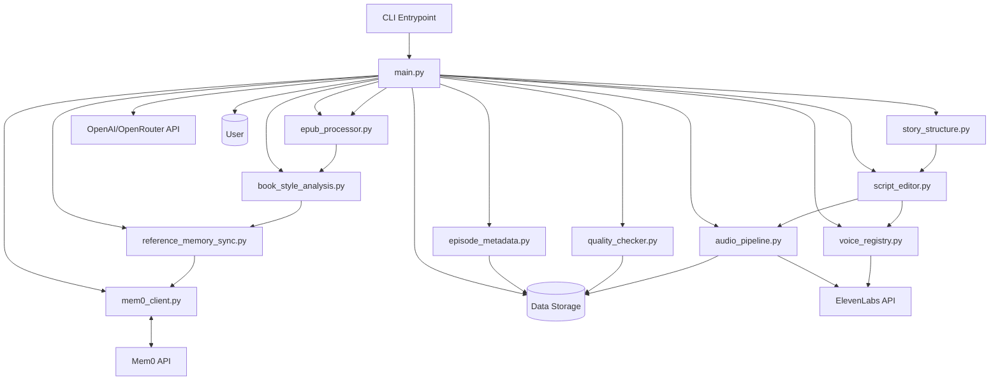
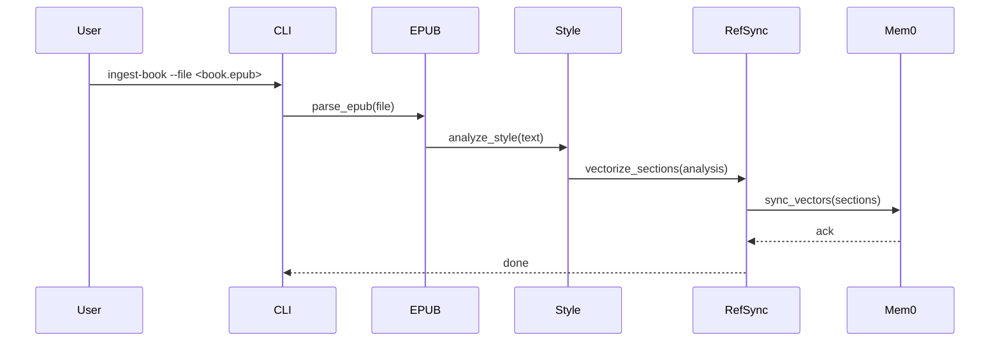
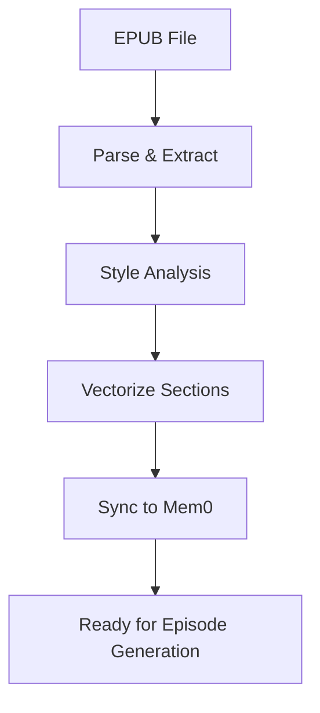

# WORKFLOW.md

> **AI-Powered Star Trek-Style Podcast Generation System**  
> _Comprehensive Technical Reference & Implementation Guide_

---

## Table of Contents

1. [System Architecture Overview](#system-architecture-overview)
2. [Core Workflow Processes](#core-workflow-processes)
3. [Data Models and Schemas](#data-models-and-schemas)
4. [Component Reference](#component-reference)
5. [Examples and Sample Workflows](#examples-and-sample-workflows)
6. [Advanced Technical Considerations](#advanced-technical-considerations)
7. [Flow Charts and Visualizations](#flow-charts-and-visualizations)
8. [Implementation Guidance](#implementation-guidance)
9. [Integration Testing Scenarios](#integration-testing-scenarios)
10. [Glossary and Reference](#glossary-and-reference)

---

## 1. System Architecture Overview

### 1.1 High-Level Architecture Diagram



### 1.2 Architectural Layers

- **Presentation Layer:**  
  - CLI (`cli_entrypoint.py`)
  - User interaction, command parsing, and output

- **Business Logic Layer:**  
  - Episode generation, script editing, audio pipeline, quality checking, memory management

- **Data Storage Layer:**  
  - JSON files in `episodes/`, `books/`, `data/`
  - Vector database (Mem0)
  - Audio files

- **AI Interfaces:**  
  - OpenAI/OpenRouter (LLM text generation)
  - ElevenLabs (voice synthesis)
  - Mem0 (vector memory)

### 1.3 Data Flow

- **Synchronous:**  
  - CLI command → Python function calls → File I/O
- **Asynchronous:**  
  - HTTP requests to OpenAI, ElevenLabs, Mem0 APIs

### 1.4 External Dependencies

| Dependency      | Purpose                                 | Integration Point         |
|-----------------|-----------------------------------------|--------------------------|
| OpenAI/OpenRouter | LLM text generation (titles, scripts) | `openai` Python package  |
| ElevenLabs      | Voice synthesis                         | `elevenlabs` package     |
| Mem0            | Vector memory for reference/continuity  | `mem0_client.py`         |
| ebooklib        | EPUB parsing                            | `epub_processor.py`      |
| ffmpeg-python   | Audio processing                        | `audio_pipeline.py`      |
| nltk            | Text analysis                           | `book_style_analysis.py` |
| tqdm, colorama  | CLI UX                                  | CLI, progress bars       |

---

## 2. Core Workflow Processes

### 2.1 E-book Ingestion and Vectorization Pipeline

#### Step-by-Step Execution Flow

1. **User Command:**  
   `python cli_entrypoint.py ingest-book --file <book.epub>`
2. **EPUB Parsing:**  
   - `epub_processor.py` extracts metadata, chapters, and text.
3. **Style Analysis:**  
   - `book_style_analysis.py` analyzes writing style, themes, and character patterns.
4. **Vectorization:**  
   - `reference_memory_sync.py` splits content into sections, vectorizes, and syncs with Mem0.
5. **Storage:**  
   - Processed data saved in `books/<book_id>/` and Mem0.

#### Sequence Diagram



#### Data Transformation

- **EPUB → Raw Text → Analyzed Sections → Vector Embeddings**

#### Error Handling

- If EPUB parsing fails, log error and abort.
- If Mem0 is unavailable, retry with exponential backoff.

#### Resource Utilization

- CPU: EPUB parsing, style analysis
- Network: Mem0 API calls

---

### 2.2 Knowledge Extraction and Pattern Learning

- Extracts entities, relationships, and narrative patterns from ingested books.
- Stores as structured memories in Mem0 for LLM prompting.

---

### 2.3 Episode Outline Generation

1. **User Command:**  
   `python cli_entrypoint.py generate-outline --book <book_id> --episode <ep_id>`
2. **Outline Generation:**  
   - `story_structure.py` uses LLM to generate Save the Cat beats.
   - References Mem0 for continuity and style.
3. **Storage:**  
   - Outline saved in `episodes/<ep_id>/structure.json`.

---

### 2.4 Script Generation

- Follows Save the Cat structure.
- LLM generates scene-by-scene scripts, referencing character and memory data.
- **Scripts are formatted as arrays of lines, each with a `character` and `line` field, to ensure compatibility with the audio pipeline.**
- **Character names in the script must match those in the voice registry for correct voice assignment.**

---

### 2.5 Character Voice Profile Creation

- `voice_registry.py` manages mapping of characters to ElevenLabs voices.
- Profiles stored in `voices/registry.json`.

---

### 2.6 Memory and Continuity Management

- `episode_memory.py` extracts and stores key plot/character memories after each episode.
- Ensures narrative coherence across episodes and seasons by referencing stored memories during outline and script generation.
- **When generating new episodes, the system queries Mem0 for relevant memories and facts from previous episodes and the reference book, maintaining story continuity.**

---

### 2.7 Audio Generation and Post-Processing

- `audio_pipeline.py` generates scene audio using ElevenLabs, mixes, and concatenates.
- Uses `ffmpeg-python` for post-processing.

---

### 2.8 Season Arc Planning

- `story_structure.py` supports multi-episode arc planning, referencing Mem0 for continuity.

---

## 3. Data Models and Schemas

### 3.1 Episode Structure Example

```json
{
  "episode_id": "ep_123",
  "title": "Shadows of the Prophets",
  "scenes": [
    {
      "scene_number": 1,
      "summary": "The crew receives a mysterious signal...",
      "characters": ["Aria T'Vel", "Jalen"],
      "script": [
        {"character": "Aria T'Vel", "line": "Report, Jalen."},
        {"character": "Jalen", "line": "We're detecting an anomaly..."}
      ]
    }
  ]
}
```

### 3.2 Vector Memory Schema

```json
{
  "id": "mem_001",
  "embedding": [0.123, 0.456, ...],
  "metadata": {
    "source": "book",
    "section": "chapter_1",
    "summary": "Introduction to Bajor"
  }
}
```

---

## 4. Component Reference

### 4.1 `mem0_client.py`

- **Function:** Interface to Mem0 vector database.
- **Interface:** `get_mem0_client()`
- **Implementation:** Singleton pattern, async HTTP calls.
- **Performance:** Batches vector syncs for efficiency.
- **Config:** `data/mem0_config.json`
- **Testing:** Mock Mem0 API for unit tests.

---

## 5. Examples and Sample Workflows

### 5.1 Ingesting a Star Trek Novel

```bash
python cli_entrypoint.py ingest-book --file books/DS9_Prophets.epub
```

### 5.2 Generating an Episode Outline

```bash
python cli_entrypoint.py generate-outline --book ds9_prophets --episode ep_001
```

---

## 6. Advanced Technical Considerations

- **Memory Optimization:** Use chunked vector uploads, cache embeddings.
- **Parallelization:** Use `concurrent.futures` for scene audio generation.
- **Caching:** Store LLM outputs for repeated prompts.
- **Scaling:** Shard Mem0 by book/season.
- **Error Recovery:** Retry failed API calls, log and skip failed scenes.

---

## 7. Flow Charts and Visualizations

### 7.1 Book Ingestion Pipeline



---

## 8. Implementation Guidance

- **Best Practice:** Always use the CLI workflow to ensure scripts and structures are formatted for audio generation and that story continuity is maintained. Avoid manual edits unless you understand the required formats.
- **Coding Standards:** PEP8, docstrings, type hints.
- **Module Organization:** One domain per module.
- **Testing:** Use `pytest`, mock external APIs.
- **Config Management:** `.env` for secrets, `data/` for persistent config.
- **Deployment:** Windows 10, Python 3.8+, FFmpeg in PATH.
- **Monitoring:** Log to `logs/`, monitor API quotas.

---

## 9. Integration Testing Scenarios

- **End-to-End:** Ingest book → Generate episode → Produce audio.
- **Edge Cases:** Missing scenes, API quota exceeded, file I/O errors.
- **Performance:** Batch process 10+ episodes, measure time/memory.

---

## 10. Glossary and Reference

| Term         | Definition |
|--------------|------------|
| Mem0         | Vector database for semantic memory |
| Save the Cat | Narrative structure for episode outlines |
| ElevenLabs   | Voice synthesis API |
| OpenRouter   | LLM API provider |
| ...          | ...        |

---

## API Reference

- **CLI Commands:**  
  - `ingest-book`, `generate-outline`, `generate-script`, `generate-audio`, `check-quality`, etc.
- **Config Reference:**  
  - `.env`, `data/mem0_config.json`, `voices/registry.json`

---

## Troubleshooting Guide

- **Audio not playing:** Check file format, re-encode with FFmpeg.
- **API quota exceeded:** Wait or use a different API key.
- **File not found:** Verify paths, check for typos.

---

**[Expand any section for more detail or request specific diagrams, code, or examples!]**
